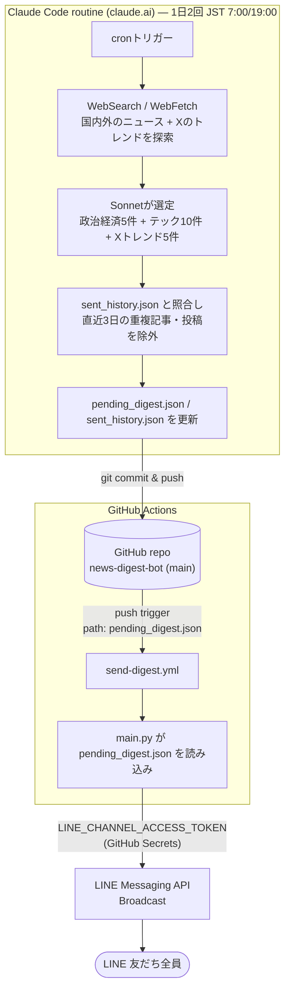

# ニュースダイジェスト配信bot

1日2回、Web全体(海外含む)を検索してニュースを選び、LINEに配信します。

- 政治・経済ニュース: 5件
- テック系ニュース: 10件 (AI・ソフトウェア・半導体を中心に、海外ソースも含めて選定)
- Xトレンド(テック): 5件 (X上で話題のテック関連投稿)
- 合計 約20件/回
- 直近3日以内に配信済みの記事・投稿は重複配信しない (`sent_history.json` で管理)

## 仕組み(2段構成)



1. **記事選定 — Claude Code routine**
   PCの起動状態に関係なくクラウド上で1日2回起動し、Web検索(WebSearch/WebFetch)で
   国内外のニュースとXのトレンドを探索。Sonnetが政治経済5件・テック10件・Xトレンド5件を
   選び、要約とあわせて `pending_digest.json` に書き出し、`sent_history.json`
   (重複防止用の配信済みURL履歴)とともにこのリポジトリへコミット&プッシュする。

2. **配信 — GitHub Actions**
   `pending_digest.json` の変更をトリガーに `.github/workflows/send-digest.yml` が起動し、
   `LINE_CHANNEL_ACCESS_TOKEN`(GitHub Secretsで管理)を使ってLINEへ配信する。

この分離により、LINEのトークンはGitHub Secretsの外に一切出ない。

## セットアップ

### 1. 依存パッケージのインストール

```bash
python3 -m venv .venv
.venv/bin/pip install -r requirements.txt
```

### 2. LINE Messaging API の準備

LINE Notifyは2025年3月末に終了したため、LINE Messaging APIの「Broadcast(全友だち配信)」を使います。

1. [LINE Developers Console](https://developers.line.biz/) にログイン
2. 新規プロバイダー作成 → 「Messaging API」チャネルを作成
3. チャネル基本設定から「チャネルアクセストークン(長期)」を発行
4. 「Messaging API設定」タブのQRコードで、このBotを自分のLINEで友だち追加
   (自動応答・あいさつメッセージはオフにしておくと通知だけがシンプルに届きます)

### 3. トークンの設定

本番配信用(GitHub Actions): リポジトリの Settings → Secrets and variables → Actions で
`LINE_CHANNEL_ACCESS_TOKEN` を登録(`gh secret set` でも可)。

もしローカル環境でお試し運用を行ってみたい場合、以下のように行うことで動作確認が可能

```bash
cp .env.example .env
# .env を編集して LINE_CHANNEL_ACCESS_TOKEN に発行したトークンを貼り付け
```

### 4. 動作確認

```bash
# pending_digest.json の内容を確認するだけ(LINEには送らない)
.venv/bin/python3 main.py --dry-run

# 実際にLINEへ配信
.venv/bin/python3 main.py
```

### 5. Claude Code routine の設定(記事選定の自動化)

記事選定は [claude.ai](https://claude.ai/code/routines) 上のクラウドAgent(routine)が
1日2回(JST 7:00 / 19:00)起動して行う。

1. **GitHub連携を済ませる**
   claude.ai の GitHub連携は「OAuth認可(Authorized)」と「GitHub Appのインストール(Installed)」の
   2段階になっている。`github.com/settings/applications` の Authorized OAuth Apps には出ているのに
   `github.com/settings/installations` の Installed GitHub Apps に出てこない場合、インストールが
   完了していない(認可ポップアップだけ閉じてしまった等)。その場合は claude.ai 側のGitHub連携設定
   から再接続し、OAuth許可の後に出てくる **Install/Configure画面まで進めて**、対象リポジトリ
   (`news-digest-bot`)を明示的に選択する必要がある。
2. **routineを作成する**
   Claude Codeの `/schedule` コマンド(または https://claude.ai/code/routines の「New routine」)から、
   以下の内容で作成する。
   - リポジトリ: `https://github.com/toshiki-fukui/news-digest-bot`
   - モデル: `claude-sonnet-5`
   - 許可ツール: `Bash, Read, Write, Edit, Glob, Grep, WebSearch, WebFetch`
   - cron: `0 22,10 * * *`(UTC) = JST 7:00 / 19:00 毎日
   - プロンプト: WebSearch/WebFetchでニュースとXのトレンドを探索し、政治経済5件・テック10件・
     Xトレンド(テック)5件を選定して `pending_digest.json` を書き出し、`sent_history.json`
     (直近3日分の重複防止履歴)を更新して `main` ブランチへコミット&プッシュする、という内容
     (詳細は作成済みroutineの設定を参照)。
3. **routineの確認・編集・削除**
   一覧・実行ログの確認や削除は https://claude.ai/code/routines から行う(APIからの削除は不可)。
   即時実行して動作確認したい場合は「Run now」を使う。

<details>
<summary>実際に使ったコマンド(RemoteTrigger action: update)</summary>

3x/day → 2x/day・テック15件→10件・Xトレンド5件追加、への変更はroutine作成後に
以下の`update`コマンドで反映した(初回作成時は`action: "create"`で同じ`body`を使う)。

```json
{
  "action": "update",
  "trigger_id": "<REDACTED>",
  "body": {
    "name": "news-digest-bot: 記事選定 (2x/day)",
    "cron_expression": "0 22,10 * * *",
    "job_config": {
      "ccr": {
        "environment_id": "<REDACTED>",
        "session_context": {
          "model": "claude-sonnet-5",
          "sources": [
            {"git_repository": {"url": "https://github.com/toshiki-fukui/news-digest-bot"}}
          ],
          "allowed_tools": ["Bash", "Read", "Write", "Edit", "Glob", "Grep", "WebSearch", "WebFetch"]
        },
        "events": [
          {
            "data": {
              "uuid": "5bd9b408-ad15-4bb8-b20f-ef398f147bd5",
              "session_id": "",
              "type": "user",
              "parent_tool_use_id": null,
              "message": {
                "role": "user",
                "content": "あなたはニュースダイジェスト配信システムの記事選定エージェントです。このリポジトリ(news-digest-bot)にチェックアウト済みの状態で起動しています。\n\n## タスク\n1. 現在時刻(JST)を確認し(例: `TZ='Asia/Tokyo' date`)、run_labelを決める(例: \"7/23 07:00\"のように月/日と時刻を含める)。\n2. `sent_history.json` を読み込み、現在時刻から72時間(3日)以上前のエントリは重複防止の対象から除外する(=古いエントリとして扱う)。\n3. WebSearch / WebFetch を使って、Web全体(国内外)からニュースを探索する。\n   - 政治・経済ニュース: 日本国内を中心に重要なものを5件\n   - テックニュース: AI・ソフトウェア・半導体を中心に10件。日本語ソースだけでなく海外の英語ソース(TechCrunch, The Verge, Reuters, Bloomberg, Ars Technicaなど)も積極的に含める\n   - テックニュースの `sent_history.json` の直近3日分に含まれるURLの記事は選ばない(重複配信防止)\n   - 速報性・重要性の高いものを優先する\n4. さらに、X(旧Twitter)上で話題になっているテック関連の投稿・トレンドを5件選定する。\n   - WebSearchで `site:x.com` や `site:twitter.com`、または「トレンド X テック」「バズっている X AI」などで検索し、現在話題の投稿(AI・ソフトウェア・ガジェット系など幅広くテック全般)を探す。\n   - 引用元のニュース記事で「Xで話題になっている」と紹介されている投稿も対象としてよい。\n   - 各投稿のリンクは実際の `https://x.com/...` または `https://twitter.com/...` の投稿ページURLとする(間接的なまとめ記事のURLではなく、可能な限り投稿本体へのURLにする)。\n   - これも `sent_history.json` の直近3日分と重複しないようにする。\n5. 選定したニュース・投稿それぞれについて次の情報を用意する:\n   - title: ニュースは記事タイトル(日本語)。Xの投稿は内容を短く日本語で要約したものをタイトル代わりにする。海外ソースは日本語に翻訳・要約する。\n   - summary: 1〜2文程度の日本語要約\n   - source: ニュースはメディア名。Xの投稿は投稿者のアカウント名(例: \"@username\")\n   - link: 記事/投稿URL\n6. `pending_digest.json` を次の形式で上書きする:\n```json\n{\n  \"run_label\": \"<決めたrun_label>\",\n  \"politics_economy\": [ {\"title\":\"...\",\"summary\":\"...\",\"source\":\"...\",\"link\":\"...\"} /* 5件 */ ],\n  \"tech\": [ {\"title\":\"...\",\"summary\":\"...\",\"source\":\"...\",\"link\":\"...\"} /* 10件 */ ],\n  \"x_trending_tech\": [ {\"title\":\"...\",\"summary\":\"...\",\"source\":\"@...\",\"link\":\"...\"} /* 5件 */ ]\n}\n```\n7. `sent_history.json` を更新する: 手順2で除外した古いエントリを削除しつつ、新しく選定したニュース・X投稿全てのURLを現在のUNIXタイムスタンプ(秒)で追加して保存する。\n8. 変更した `pending_digest.json` と `sent_history.json` を `git add` し、コミットメッセージ `News digest: <run_label>` でコミットし、`main` ブランチに push する。\n\n## 注意事項\n- LINEへの配信はこのエージェントの責務ではない(pending_digest.json を push すると、別のGitHub Actionsワークフローが自動で配信する)。\n- LINE_CHANNEL_ACCESS_TOKEN など配信用の認証情報には一切触れない。\n- 目標件数(政治経済5件・テック10件・Xトレンド5件)の確保に努めるが、質を犠牲にした水増しはしない。Xトレンドが十分に見つからない場合は件数を減らしてもよい。\n- 最後に `git log -1` や `git status` で push が成功したことを確認する。"
              }
            }
          }
        ]
      }
    }
  }
}
```

`environment_id` / `trigger_id` は `<REDACTED>` を、[claude.ai](https://claude.ai/code/routines) の
Environments設定・自分のroutine一覧(`RemoteTrigger action: list`)で確認できる自分の値に置き換えること。
`uuid` は `events[].data.uuid` 用に生成した固定値で、再作成する場合は新しいv4 UUIDを発行すること。

</details>

### 6. GitHub Actions の設定(配信の自動化)

配信ワークフローは `.github/workflows/send-digest.yml` としてリポジトリに含まれており、
`pending_digest.json` の変更をpushしたタイミングで自動的に起動する(追加設定は不要)。
セットアップ時に必要なのは以下のSecret登録のみ。

```bash
gh secret set LINE_CHANNEL_ACCESS_TOKEN --body "<発行したチャネルアクセストークン>"
```

もしくはGitHubリポジトリの Settings → Secrets and variables → Actions から手動で登録してもよい。
登録後は、GitHubの「Actions」タブ → 「Send News Digest」→「Run workflow」から手動実行して
動作確認できる(直近の `pending_digest.json` の内容が再送信される)。

## データファイル

- `pending_digest.json` — routineが書き出す配信対象記事・投稿(`politics_economy` / `tech` / `x_trending_tech`、選定のたびに上書き)
- `sent_history.json` — 配信済み記事・X投稿URLと配信時刻(直近3日分)。重複配信を防ぐためroutineが管理する。

## 自動実行

- **記事選定**: Claude Code routine(JST 7:00 / 19:00、Sonnet + Web検索)
- **LINE配信**: GitHub Actions(`pending_digest.json` へのpushをトリガーに自動実行)

手動でテストしたい場合は、GitHubリポジトリの「Actions」タブ → 「Send News Digest」→
「Run workflow」で即時実行できます(直近の `pending_digest.json` の内容を再送信します)。
